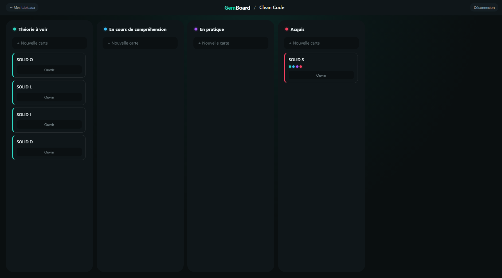
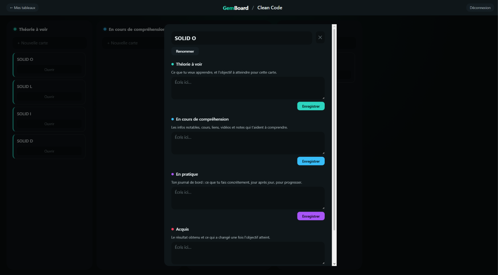
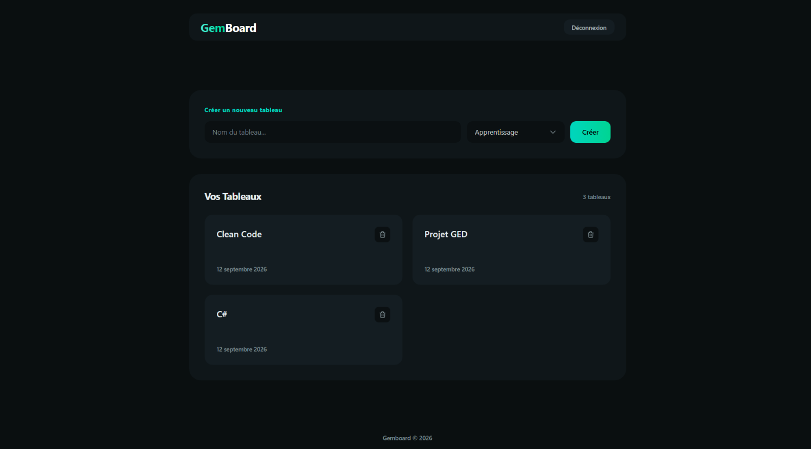
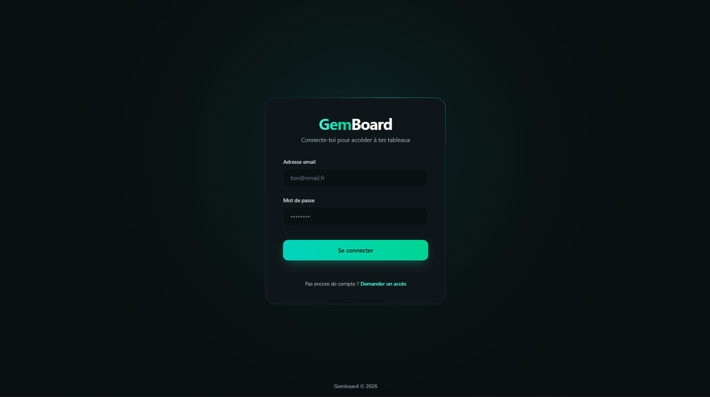

# GemBoard

**A guided task board for people who organise themselves** — solo makers, freelancers and learners.
Not another generic Kanban: in GemBoard each column is a *step with a purpose*, and a card **accumulates its content as it moves through the workflow** — so a card becomes the readable history of its own progress.

🔗 **Live demo:** https://kanban-cyril14.vercel.app
📦 **Backend repository:** https://github.com/cyriltheeten-sudo/Kanban.api



> ⏱️ The API runs on Render's free tier and sleeps after inactivity — the **first request can take ~30s** to wake it up.

> 🔑 **Demo access** — account creation is restricted to admins, so use the demo account:
> **email:** `demo@kanban.fr` · **password:** `demo`

---

## What makes it different

Generic boards give you empty columns and don't care what you put in them. GemBoard ships with **guided templates** (e.g. *Learning*, *Development cycle*) where every step tells you what to write, and a card carries a **separate entry per step** — objective, resources, journal, outcome — all kept as you progress. The goal is a tool with a point of view: it helps you *frame and track* your progress rather than just move tickets around.

## Features

- **Guided project templates** — predefined step-columns, each with its own guidance (e.g. *Learning*: Theory → Understanding → Practice → Acquired).
- **Cards that accumulate** — one editable entry per step, so a card holds its whole journey. Coloured pastilles on each card show at a glance which steps are filled.
- **Real-time collaboration** — boards sync live across clients via SignalR (WebSockets).
- **Drag & drop** — reorder cards and move them between steps (@dnd-kit), with optimistic UI.
- **Authentication & data isolation** — JWT auth; every action is checked so a user can only reach their own boards, columns and cards.
- **Polished dark UI** — custom design-token theme, responsive.

## Tech stack

| Layer | Technologies |
|---|---|
| **Frontend** | React 19 · TypeScript · Vite · Tailwind CSS v4 · React Router v7 · @dnd-kit · @microsoft/signalr · Vitest |
| **Backend** | ASP.NET Core (.NET 8) · Entity Framework Core · SignalR · PostgreSQL · JWT |
| **Infra** | Frontend on Vercel · API on Render (Docker) · Database on Neon |

## Architecture highlights

A few things I paid particular attention to:

- **Centralised API client** — a single `apiFetch` wrapper handles auth headers, error normalisation and session expiry, so error handling lives in one place.
- **Custom hooks** — board loading, real-time sync and drag-and-drop are each extracted into their own hook (`useBoard`, `useBoardRealTime`, `useDragAndDrop`), keeping the page component thin.
- **Read DTOs** — the API never serialises entities directly; dedicated read DTOs shape exactly what the client receives and avoid reference cycles.
- **Object-level authorisation** — ownership is enforced *before* every mutating action through a single `IsBoardOwnedBy` check; unauthorised access returns `404` without revealing whether the resource exists.
- **Rate-limited login** — 5 attempts/min per IP (fixed window), with the real client IP resolved correctly behind the hosting proxy.

## Running locally

### Prerequisites
- Node.js 18+ and npm
- .NET 8 SDK
- A PostgreSQL database (local or hosted)

### Backend
See the [backend repository](https://github.com/cyriltheeten-sudo/Kanban.api). It expects the following configuration (via user secrets or environment variables):

- `ConnectionStrings__DefaultConnection` — your PostgreSQL connection string
- `Jwt__Key` — a secret signing key
- `Jwt__Issuer` — the token issuer

Then run `dotnet run`. Migrations are applied and the default templates seeded on startup.

### Frontend

```bash
npm install

# .env.development
# VITE_API_URL=https://localhost:7007

npm run dev
```

## Testing

The API is covered by **30 xUnit unit tests** on the service layer (business logic + per-user data isolation), using EF Core's in-memory provider so each test runs in isolation, plus an **integration test suite** that drives the real HTTP pipeline end-to-end (real JWTs, two distinct users) to verify the object-level authorization boundary — e.g. a user moving their own card into another user's column, or writing an entry on a card they don't own, gets a `404` and the data is left untouched.

```bash
dotnet test
```

The frontend's `hooks/` and `utils/` are covered by a **Vitest** suite. See [testing.md](testing.md) for what's covered and how it's set up.

```bash
npm test
```

## Screenshots

**Card detail** — each step shows its guidance and its own editable entry; the card's whole journey in one place.



**Your boards** — create a board from a template and see them all at a glance.



**Sign in**



## Status

GemBoard is deployed and actively used to track my own projects and learning. See the backend repository's testing notes for what is covered and what's planned next.

---

**Author** — Cyril Theeten · [LinkedIn](https://www.linkedin.com/in/cyril-theeten-258a5115a/)
