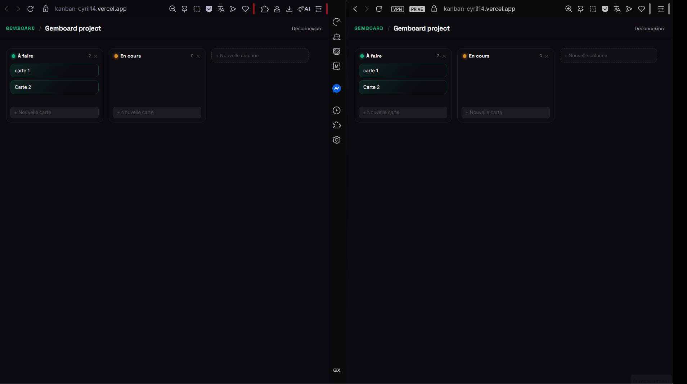

# Gemboard — Real-time collaborative Kanban board

A multi-user project management tool (Trello-style) with **real-time collaboration**: when one user moves, adds or edits a card, everyone else sees it instantly — no refresh. Built and deployed end-to-end as a full-stack portfolio project.

**🔗 Live demo: https://kanban-cyril14.vercel.app**

> The API is hosted on a free tier that sleeps after inactivity — the **first request may take ~30–60s** to wake up, then it's instant.


---

<!-- TODO: replace with a GIF of the real-time demo (two windows side by side, a card moved in one appears in the other). -->


---

## Features

- **Real-time collaboration** — changes propagate live to all connected users via SignalR (WebSockets).
- **Authentication** — sign-up / login with JWT, password hashing, protected routes.
- **Boards, columns, cards** — full CRUD from the interface.
- **Drag & drop** — move cards within and across columns, with server-side persistence of order.
- **Production-ready** — deployed to the cloud with proper CORS, environment variables and secrets handling.

## Tech stack

| Layer | Technologies |
|---|---|
| **Frontend** | React 19, TypeScript, Vite, Tailwind CSS, @dnd-kit, @microsoft/signalr |
| **Backend** | ASP.NET Core (C#), Entity Framework Core, SignalR, JWT |
| **Database** | PostgreSQL (Neon) |
| **Deployment** | Vercel (frontend), Render + Docker (API), Neon (database) |

## Architecture

```
Frontend (Vercel)  ──REST + WebSocket──►  API (Render, Docker)  ──►  PostgreSQL (Neon)
        ▲                                        │
        └──────────── real-time (SignalR) ───────┘
```

The frontend is a static build served on a CDN; the API is a containerized ASP.NET Core service. Writes go through the REST API, and the API broadcasts changes over SignalR so every connected client stays in sync.

## Repositories

- **Frontend** — this repository
- **Backend API** — https://github.com/cyriltheeten-sudo/Kanban.api

## Running locally

You need the [backend API](https://github.com/cyriltheeten-sudo/Kanban.api) running first (see its README).

```bash
# 1. install dependencies
npm install

# 2. point the app at your local API
#    create a .env.development file with:
#    VITE_API_URL=https://localhost:7007

# 3. start the dev server
npm run dev
```

The app runs on `http://localhost:5173`.

## What this project demonstrates

Full-stack ownership from design to production: a relational data model, authentication, real-time communication, modern UI interactions, and a complete cloud deployment (containerization, managed database, environment configuration).
